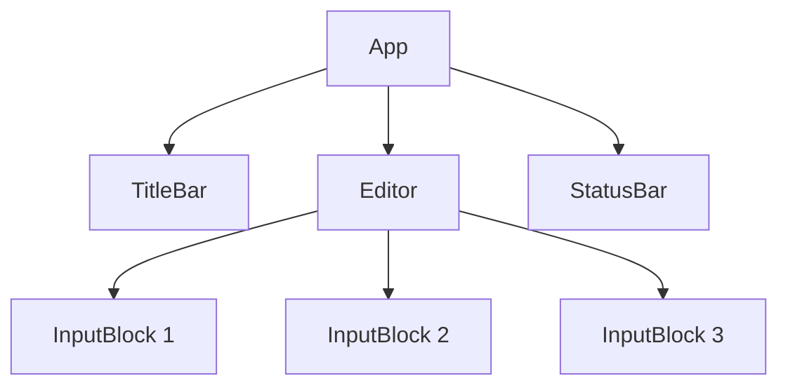
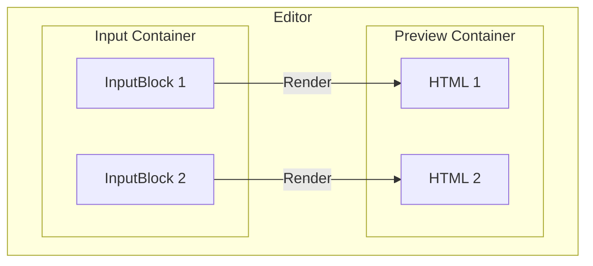
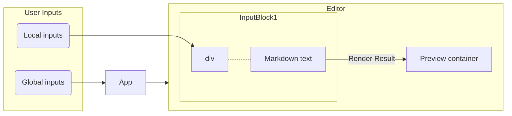

# Project Architecture

This document describes the architecture of the project. It is intended to be 
viewed by developers who want to understand the source code.

## Overview

The architecture of components:

## Editor and Input Blocks

The Editor and InputBlock are the main components of this project. Their location:

- Editor: `src/components/Editor.vue`
- InputBlock: `src/components/InputBlock.vue`

An InputBlock is a Vue component (`InputBlock.vue`), each of them manages a div element in the input container, in which user can enter text. The text content is also managed by the InputBlock, and upon request (by the Editor), InputBlocks communicate with the Renderer directly to render the text content into string of HTML, which is then passed to the Editor for it to show in the preview container.

The Editor (`Editor.vue`) is a container around both the **input container** and **preview container** (both are a div element). It manages all logic and states that exceeds the scope of each input block, such as the creation, deletion and reordering of input blocks.

Relationship between Editor and InputBlock:

### Handling User Inputs

Each InputBlock is responsible for managing its own text content (`content` is a member varable of InputBlock). When user inputs markdown text, it triggers HTML listeners (with `keydown` and `keyup` etc.), so content update are handled by the InputBlocks internally, and anything that exceeds the scope of an InputBlock, will cause it to emit an event to the Editor.

The Editor should not manipulate the `content` of the InputBlock. Instead, when it needs to render and update the preview container, it should call the `renderToHtml` method of InputBlock to get the rendered HTML string, which is then passed to the preview container.

### File IO

> Note: This section is not yet implemented.

#### File Loading

Upon file opening, the input container is cleared, then the Editor creates a new InputBlock for each Markdown block in of the file (defined by an empty line), and pass the initial content to each InputBlock. The Editor then calls `renderToHtml` for each InputBlock to get the rendered HTML, and pass to the preview container.

> Note that the content that Editor passes to each InputBlock is only the initial content, all further content updates are handled by the InputBlock itself.

#### File Saving

Since all Markdown text is stored in the `content` of each InputBlock, the Editor can simply iterate through all InputBlocks and get the `content` of each one, then concatenate them together to get the final Markdown text, which is then saved to the file.

## Global State Management

Vue's event emission does not bubble, and some states in our app is shared by multiple components, like data about caret position, word count, etc. But we still want Vue's reactivity, so we store all global states in `src/assets/js/store.ts`. Components that use any shared global states should import from this file.
