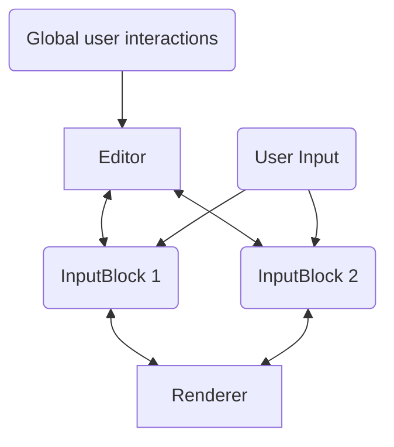

# Project Architecture

This document describes the architecture of the project. It is intended to be 
viewed by developers who want to understand the source code.

## Overview

## Editor and Input Blocks

The Editor and InputBlock are the main components of this project. Their location:

- Editor: `src/components/Editor.vue`
- InputBlock: `src/components/InputBlock.vue`

An InputBlock correspond to an user-editable div in the input container. The (user-inputted) text content are managed by the corresponding InputBlock, and InputBlocks communicate with the Renderer directly to render the text content into MD string, which is then passed to the Editor for it to show in the preview container.

The Editor is a container around both the input container and preview container. It manages all logic and states that exceeds the scope of each input block. 

Overall relationship:

### Handling User Inputs

Each InputBlock is responsible for managing its own text content (`content` is a member varable of InputBlock). Since all inputs are triggered by HTML listeners (with `@keydown` and `@kyeup` etc.), they are handled by the InputBlocks directly, so content update are handled internally in this component.

The Editor should not manipulate the `content` of the InputBlock. Instead, when it needs to render and update the MD preview, it should call the `renderToHtml` method of InputBlock to get the rendered HTML, then pass to the preview container.
